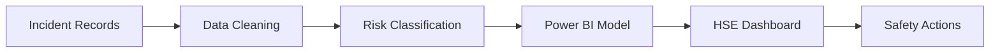

# Predictive Safety Risk Insight Dashboard

An interactive **Health, Safety and Environment (HSE) analytics dashboard** developed in Microsoft Power BI to analyse workplace incidents, hazard exposure, severity patterns and operational risk indicators from 2015 to 2017.

The dashboard transforms historical safety records into actionable information that can support HSE teams in prioritising inspections, allocating preventive resources and monitoring high-risk operational areas.

  

## Project Overview

| Item            | Description                                                               |
| --------------- | ------------------------------------------------------------------------- |
| Domain          | Health, Safety and Environment Analytics                                  |
| Analysis period | 2015–2017                                                                 |
| Primary tool    | Microsoft Power BI                                                        |
| Total incidents | 4,847                                                                     |
| Analysis focus  | Hazard exposure, incident severity, risk trends and injury patterns       |
| Intended users  | HSE managers, safety officers, operational managers and business analysts |

## Business Problem

Workplace incident data is often stored across multiple reports, making it difficult for safety teams to identify recurring patterns and prioritise preventive actions.

This project addresses the following business questions:

* Which hazard categories contribute the most safety cases?
* How have incidents changed over time?
* Which months and days record higher incident frequencies?
* What are the most common incident types?
* Which body parts are most frequently affected?
* Where should safety teams prioritise inspections, training and preventive controls?

## Project Objectives

The dashboard was developed to:

1. Consolidate workplace incident data into a central analytical view.
2. Monitor incident volume and severity across time.
3. Identify high-risk hazard categories and incident types.
4. Analyse temporal patterns by year, month and day of the week.
5. support targeted safety inspections and training programmes.
6. Improve the communication of HSE performance to management.
7. Enable proactive risk prioritisation using historical patterns and risk scores.

## Analytical Workflow

The project follows a structured analytics workflow:

1. **Data preparation** – Cleaning and standardising incident records.
2. **Risk classification** – Grouping cases by risk level, hazard category and severity.
3. **Data modelling** – Creating relationships, calculated fields and Power BI measures.
4. **Visual analysis** – Comparing incident patterns across multiple dimensions.
5. **Risk prioritisation** – Translating findings into targeted safety actions.

## Dashboard KPIs

The dashboard presents the following high-level safety indicators:

| KPI                   | Value |
| --------------------- | ----: |
| Total incidents       | 4,847 |
| Total high-risk cases |   814 |
| Average risk score    |  3.25 |
| Work-at-height cases  | 1,816 |
| General hazard cases  | 1,429 |
| Machine hazard cases  | 1,088 |
| Fatal incidents       | 2,964 |
| Non-fatal incidents   | 1,883 |

These metrics provide management with an immediate overview of incident volume, hazard exposure and severity.

> **Data-quality note:** Fatal incidents represent approximately 61% of all recorded incidents. Because this is an unusually high proportion for most real-world safety datasets, the severity definitions and source encoding should be validated before the dashboard is used for operational decision-making.

## Dashboard Analysis

### 1. Annual incident trend

The yearly analysis compares incident frequency between 2015 and 2017.

The dashboard indicates that:

* 2015 recorded the lowest number of incidents.
* Incident volume increased in 2016.
* 2017 recorded the highest number of incidents.

This upward pattern signals a need for further investigation into changes in workforce size, operational activity, reporting practices and safety controls.

Incident counts should ideally be normalised using exposure measures such as working hours or employee headcount before concluding that the underlying incident rate has increased.

### 2. Monthly risk trend

The monthly risk analysis highlights changes in safety exposure throughout the year.

Observed patterns include:

* Higher risk levels between January and March.
* A decline between April and June.
* A renewed increase around July.
* Relatively stable risk levels between August and December.

These patterns can help HSE teams determine when additional inspections or safety briefings may be required. However, operational factors such as project schedules, working hours and workforce size should be reviewed before attributing the pattern to a specific cause.

### 3. Incident type analysis

The incident-type comparison identifies the most frequently recorded events:

1. Falls.
2. Struck-by incidents.
3. Other incident categories.

Falls represent the most frequently recorded incident type and align with the high number of work-at-height hazard cases.

This finding supports further assessment of:

* Fall-prevention systems.
* Guardrail and access-platform conditions.
* Safety harness compliance.
* Work-at-height permit procedures.
* Employee competency and supervision.

### 4. Incident frequency by day

The dashboard compares incident volume across the days of the week.

Wednesday records the highest incident count, while Saturday and Sunday record the lowest.

The weekday pattern should be treated as an investigation signal rather than evidence of causation. Possible factors to examine include:

* Workforce scheduling.
* Number of working hours.
* Production volume.
* Task complexity.
* Shift allocation.
* Contractor activity.

Normalising incidents by hours worked per day would provide a more meaningful risk comparison.

### 5. Hazard category analysis

The main hazard categories are ranked as follows:

1. Work at height.
2. General hazard.
3. Machine hazard.
4. Vehicle hazard.
5. Chemical hazard.

Work at height represents the largest recorded hazard category, making it a priority area for inspections and preventive controls.

Machine and vehicle hazards also require continued monitoring because of their potential to produce high-severity incidents.

### 6. Injury analysis by body part

The dashboard identifies the most frequently affected body parts:

1. Head.
2. Whole body.
3. Fingers.

These results can guide further investigation into:

* Personal protective equipment compliance.
* Machine-guarding effectiveness.
* Hand-tool and equipment handling.
* Impact and struck-by exposure.
* Emergency response procedures.

The data identifies where injuries occurred but does not independently prove that PPE non-compliance caused them.

## Key Findings

The analysis highlights the following patterns:

* Incident volume increased between 2015 and 2017.
* Work at height was the largest hazard category.
* Falls were the most frequently recorded incident type.
* Wednesday recorded the highest incident volume.
* Head injuries were the most frequently recorded injury category.
* January to March showed comparatively higher risk levels.
* High-risk cases require targeted investigation and control measures.
* The unusually high proportion of fatal incidents requires data validation.

## Recommended Actions

### Prioritise work-at-height controls

* Conduct focused inspections of scaffolding, ladders and elevated work areas.
* Verify safety harness, anchor point and guardrail compliance.
* Review work-at-height permit procedures.
* Provide refresher training for employees and contractors.

### Strengthen incident investigation

* Perform root-cause analysis for fatal and high-risk cases.
* Separate immediate causes from underlying organisational causes.
* Track corrective actions, responsible owners and completion dates.
* Monitor repeat incidents after controls are implemented.

### Improve PPE management

* Conduct task-based PPE assessments.
* Monitor helmet and protective-equipment compliance.
* Review whether the selected PPE is appropriate for identified hazards.
* Record PPE observations during site inspections.

### Target high-risk periods

* Schedule additional safety briefings during higher-risk months.
* Increase supervisory visibility on days with higher incident frequency.
* Compare incident counts with workforce exposure before adjusting resources.
* Monitor whether targeted interventions reduce subsequent incidents.

### Improve machine-safety controls

* Review machine guarding and interlock systems.
* Strengthen lockout/tagout procedures.
* Conduct preventive maintenance inspections.
* Provide competency-based training for machine operators.

### Introduce leading safety indicators

In addition to incident counts, future reporting should include:

* Near-miss reports.
* Safety observations.
* Inspection completion rate.
* Corrective-action closure rate.
* Training completion rate.
* PPE compliance rate.
* Permit-to-work violations.

Leading indicators can help management identify deteriorating safety conditions before an incident occurs.

## Predictive Scope

The term **predictive safety insight** in this project refers to the use of historical patterns and risk scores to identify periods, hazards and operational areas that may require additional attention.

The current dashboard does not claim to provide a statistically validated accident forecast unless a separate machine-learning or time-series model has been implemented.

A future predictive model could estimate incident probability using variables such as:

* Hazard category.
* Work location.
* Shift.
* Day and month.
* Employee or contractor exposure.
* Previous incidents.
* Inspection results.
* Weather or environmental conditions.
* Task type.
* Risk-control compliance.

## Tools and Technologies

### Microsoft Power BI

* Power Query.
* Data cleaning and transformation.
* Data modelling.
* DAX measures and calculated columns.
* KPI development.
* Interactive dashboard design.
* Business-focused data storytelling.

### Analytical Techniques

* Descriptive analytics.
* Trend analysis.
* Risk segmentation.
* Incident severity analysis.
* Hazard-category comparison.
* Temporal pattern analysis.
* Root-cause investigation prioritisation.

## Data Limitations

The following limitations should be considered:

* The analysis covers only the 2015–2017 period.
* Incident counts are not normalised by workforce size or hours worked.
* Higher incident counts may reflect higher operational exposure rather than higher underlying risk.
* Historical associations do not prove causation.
* Severity and fatality classifications require validation against the source definition.
* Changes in reporting practices may affect comparisons between years.
* The risk score methodology should be documented before operational deployment.
* The dashboard should support, not replace, formal HSE risk assessments and incident investigations.

## Future Enhancements

Potential improvements include:

* Adding incident rates per 100,000 working hours.
* Integrating workforce and operational exposure data.
* Developing a validated incident-probability model.
* Adding near-miss and safety-observation analysis.
* Tracking corrective-action completion.
* Introducing site, department and contractor comparisons.
* Adding risk heatmaps and drill-through incident reports.
* Automating dataset refresh through Power BI Service.
* Developing model-performance monitoring for predictive outputs.

## Disclaimer

This dashboard was developed for analytical and portfolio demonstration purposes.

The findings represent patterns within the available dataset and should not be interpreted as confirmed causal relationships. Any real-world safety decision should also consider site inspections, formal risk assessments, exposure data and professional HSE judgement.

## Author

**Norazlina Binti Mohd Shariff**
Data Science Student | Aspiring Data Analyst

